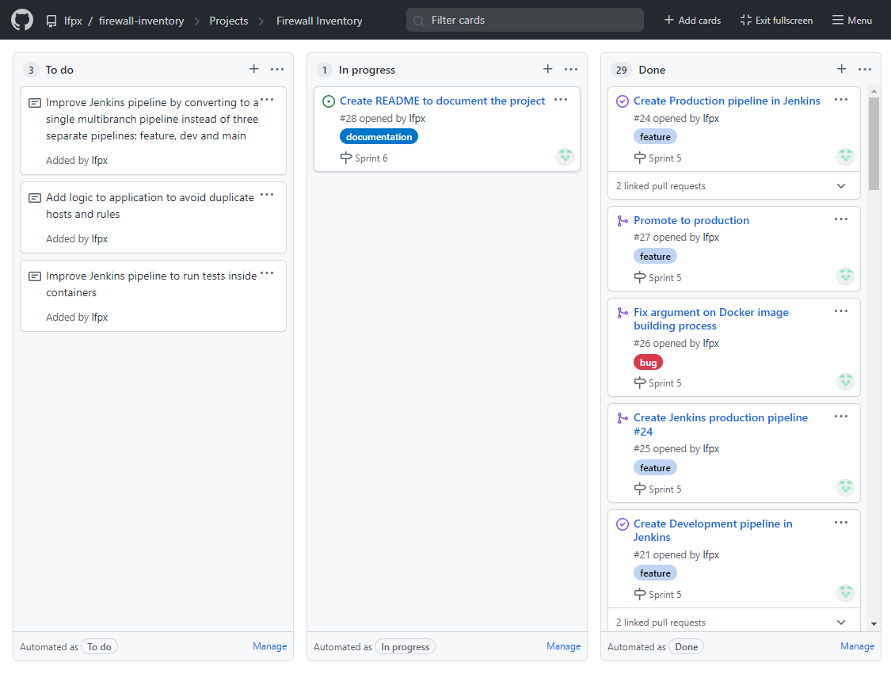
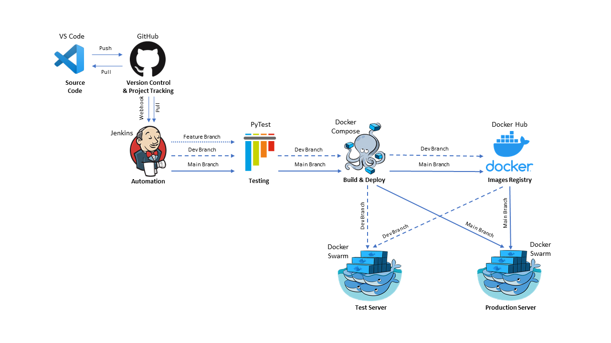
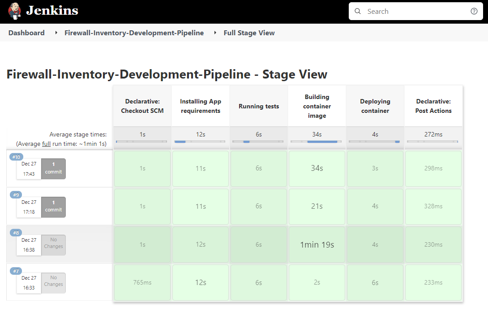
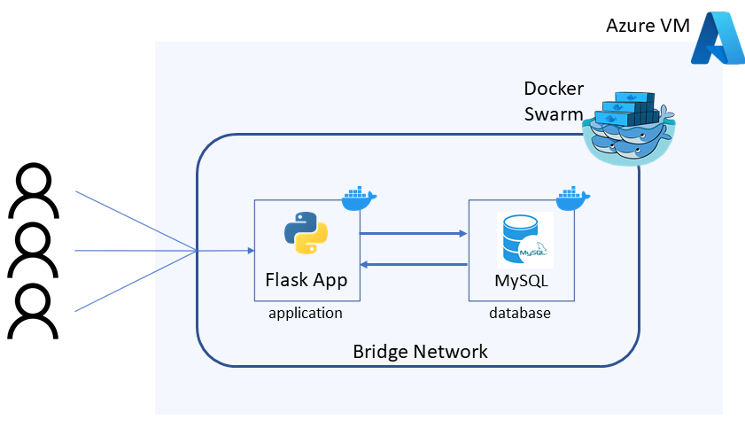
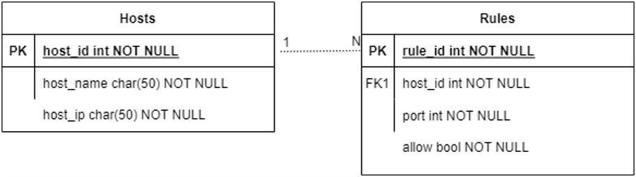
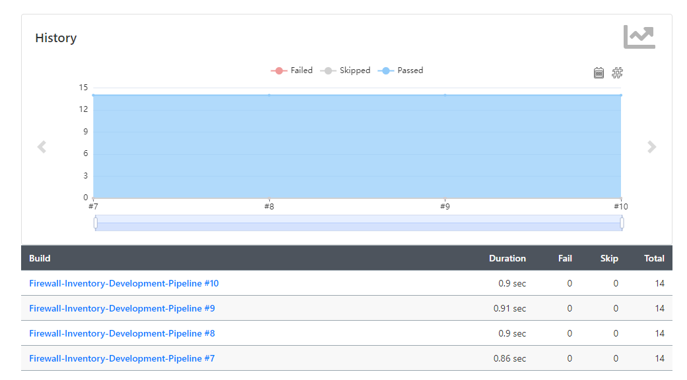
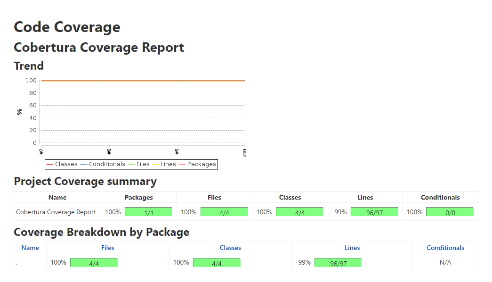

# QA DevOps Bootcamp Final Project

## Contents

* [Objective](#objetive)
* [Application](#application)
    * [Firewall Inventory](#firewall-inventory)
* [Project Management](#project-management)
* [Risk Assessment](#risk-assessment)
* [Architecture](#architecture)
    * [Pipeline](#pipeline)
    * [Application](#application)
* [Development](#development)
    * [Unit Testing](#unit-testing)
* [Future Improvements](#future-improvements)
* [Pipeline Demo](#pipeline-demo)
* [Author](#author)

## Objective

The objective provided for this project is:

>To create a monolithic web application using the Flask web framework that integrates with a database and demonstrates CRUD functionality.
>
>The application must keep track of two entities that have some kind of relationship with each other.
>
>The application must interface with a separate database service.
>
>Unit tests must be written for the application with the aim of achieving high coverage.
>
>Utilise containers to host and deploy your application to a Docker Swarm.
>
>To create a continuous integration (CI)/continuous deployment (CD) pipeline that will automatically test, build, and deploy your application.

## Application

An initial assessment of the requirements to deliver a MVP within the time frame provided indicated that the CI/CD pipeline and deployment infrastructure would be most time consuming tasks. Therefore, the application proposed is very simple and mostly used as a vehicle to demonstrate the pipeline and deployment functionality.

### Firewall Inventory

The application provides a registry of hosts, their inbound ports, and whether traffic is allowed on these ports. Hosts and rules can be created, viewed, updated, and deleted to meet the CRUD requirements.

## Project Management

The project was tracked using GitHub Projects. Tasks were written as user stories and prioritised using MoSCoW. To facilitate their tracking, tasks were labelled as *feature* (for *Must Have*), *enhancement* (*Won't have - this time*) and *bug* (for bug fixes). Due to the short timeline for this project, no taks were assigned *Should* or *Could have*.

## Risk Assessment

This risk assessment outlines the possible risks that could impact the development of this project and how they have been mitigated:

| Risk                       | Description                                                                      | Mitigation                                                                                             | Likelihood | Impact |
|:---------------------------|:---------------------------------------------------------------------------------|:-------------------------------------------------------------------------------------------------------|:----------:|:------:|
| Exceeding the deadline     | If the project is not delivered by the deadline, it will be marked down             | Split tasks into daily sprints (Scrum)                                                                   |     Low    |  High  |
| Exposed credentials        | Unauthorised access to resources if   credentials are exposed in version control | No hardcoded credentials. Use Jenkins   secrets and environment variables                            |   Medium   |  High  |
| Branch conflicts           | Merging conflicts can slow down the   project's progress                           | Use feature branches to better manage   updates.                                                       |     Low    |  High  |
| Azure severs exposed       | Unauthorized access to resources is possible if credentials are exposed                    | Only allow access using public/private   keys                                                          |     Low    |  High  |
| Jenkins server unavailable | Application won't be able to be deployed if pipeline is unavailable              | Pipeline config saved as Jenkinsfile on   GitHub to speed up its restoration on a new Jenkins server   |     Low    |  High  |
| Buggy Docker images        | Deploying Docker Images that include bugs                                        | Maintain previous versions of the image   on Docker Hub to speed up the rollback to a previous version |   Medium   |  High  |

## Architecture

### Pipeline

Continuous integration and deployment is implemented in this project using Jenkins as an automation server to provide an automated pipeline between source code and deployment.

When new code is pushed via VS Code to GitHub, it will send a webhook to Jenkins to trigger one of the three pipelines depending on which branch the code was pushed to: feature, dev or main.

The feature pipeline is the shortest, only running unit tests using pyTest and providing a coverage report.

The dev and main pipelines are similar, with the difference being the server where the artefacts will be deployed: test or production. On these pipelines:

* Unit tests are run using pyTest and a coverage report is presented on Jenkins dashboard.
* Docker Compose builds an image with the application code and pushes two versions to Docker Hub tagged as: numbered version and latest. In the event of a problem with the latest version being deployed, previous versions can be used to roll back the application to a working version.
* Jenking transfers the Docker Compose configuration file to the Docker Swarm manager node via `scp`, connects via `ssh` and triggers an update on the swarm.
* Docker Swarm will then pull the updated image from Docker Hub, stop the current running containers and create new containers with the updated image.

This screenshot of the Stage View on Jenkins shows the last four runs of the development pipeline and the result of each stage.

### Application

The application deployed on a Docker Swarm master node is comprised of two services: application and database. The application service is based on the image built with the Flask application, as explained on the previous section. The database service is based on an official MySQL image.

Only a single master node was employed due to resource constraints on the number of VMs that could be instanciated per region. The Docker Swarm master node was deployed on an Azure B1ms instance running Ubuntu 20.04.

## Development

The application was developed in Python using the Flask Framework and SQLAlchemy for the database interface. Data is structured in two tables in a one to many relationship, as shown in the entity diagram below.

### Unit Testing

Unit testing was used throughout development and is included in all Jenkins pipelines. Each route function was tested with various scenarios, asserting for each scenario the expected result. The screenshots below depict the history of these tests as well as their coverage report.

## Future improvements

Some key improvements I'd like to implement:

* The long-term goal of the application is to be able to pull firewall information from Azure VMs via API and work as a central repository for network rules.
* Improve the interface to make it look more aesthetically pleasing.
* Improve the handling of connection losses between the application and the database when the swarm is redeployed or updated.
* Use a single multibranch pipeline on Jenkins instead of three separate pipelines.
* Use Docker containers to run the tests in the pipeline.
* Use separate tags for development and production images pushed to Docker Hub.

## Pipeline Demo

This screencast demonstrates the application's CRUD functionality as well as how changes in the code are deployed to production via CI/CD pipeline.

[Screencast](https://drive.google.com/file/d/1xi8ezFVrM8TKw6vVu8DqytCEcZT_Yuc8/view)

## Author

Luiz Felipe Peixoto